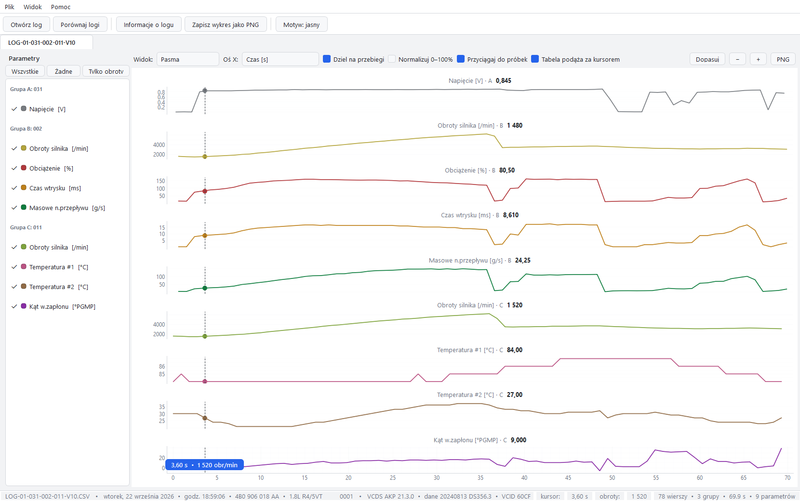

# VCDS LogScope

Program do czytelnego przeglądania logów z **VCDS / VAG-COM**. Zamiast surowego arkusza CSV
dostajesz jeden wykres ze wszystkimi parametrami, przejrzystą tabelę z kolorowaniem
i możliwość porównania kilku logów między sobą.

**[⬇ Pobierz najnowszą wersję](https://github.com/dras1911/VCDS-LogScope/releases/latest)**
&nbsp;•&nbsp; **[Zgłoś problem lub pomysł](https://github.com/dras1911/VCDS-LogScope/issues)**
&nbsp;•&nbsp; **[☕ Wspomóż projekt](https://buymeacoffee.com/dras1911)**

*Widok nakładany — wszystkie parametry na jednym wykresie.*

*Widok pasm — każdy parametr osobno, z własną skalą; czytelny przy dowolnej liczbie parametrów.*

## Co potrafi

**1. Wykres ze wszystkimi parametrami naraz** — w dwóch widokach do wyboru
- **Nakładany**: wszystkie linie na jednym wykresie, każda w innym kolorze
- **Pasma**: każdy parametr w osobnym pasie z własną skalą i nazwą — najlepszy wybór, gdy
  parametrów jest 6 lub więcej, bo nic na siebie nie nachodzi; kursor i czas są wspólne
- linia kursora: najedź myszą na wykres i w dymku masz wartości wszystkich parametrów w tym momencie
  (w widoku pasm wartość pojawia się na bieżąco w nagłówku każdego pasa)
- przy osi X wyświetla się **dokładny czas i obroty** w miejscu kursora — nie trzeba niczego zgadywać
- wykres można rysować w funkcji **czasu** albo w funkcji **obrotów**
- przy osi obrotów program dzieli dane na **przebiegi** (każde przyspieszanie osobno) i sortuje
  je po obrotach — linie nie tworzą wtedy pętli, a kolejne przyrosty można nakładać na siebie
  i porównywać; obroty przestają być wtedy rysowane jako seria, bo są osią
- „Normalizuj 0–100%” przydaje się w widoku nakładanym, gdy parametry mają bardzo różne wartości
  (obroty 0–6000, a temperatura 80–90) — wtedy widać kształt każdej linii

**2. Tabela z kolorowaniem**
- im wyższa wartość, tym mocniejszy kolor komórki — wzrosty obrotów widać na pierwszy rzut oka
- zielone ▲ i czerwone ▼ pokazują wzrost lub spadek względem poprzedniego wiersza
- wiersz podświetla się razem z kursorem na wykresie, a kliknięcie w wiersz ustawia kursor
- kolumny można ukrywać (prawy przycisk myszy na nagłówku)

**3. Porównanie dwóch lub więcej logów** (`Ctrl+T`)
- log A linią ciągłą, log B przerywaną — te same parametry w tym samym kolorze
- tabela różnic: pokazuje, ile log B ma więcej lub mniej niż log A w każdym momencie
- statystyki: minimum, maksimum, średnia dla każdego logu i największa różnica
- przesunięcie czasowe, gdy logi startowały w różnych momentach jazdy

**4. Wszystko działa lokalnie** — logi nie są nigdzie wysyłane, program nie potrzebuje internetu.

## Jak zacząć

1. Pobierz plik **`VCDS-LogScope.exe`** ze [strony wydania](https://github.com/dras1911/VCDS-LogScope/releases/latest)
   i uruchom go — nie trzeba nic instalować.
2. Przeciągnij plik CSV z VCDS na okno programu (albo `Ctrl+O`).
3. Najedź myszą na wykres i odczytuj wartości.

Przy pierwszym uruchomieniu Windows może pokazać ostrzeżenie „Nieznany wydawca” —
kliknij **Więcej informacji → Uruchom mimo to**. Tak zachowuje się każdy program
bez płatnego certyfikatu podpisu.

## Którą wersję wybrać

| Plik | System | Uwagi |
|---|---|---|
| `VCDS-LogScope.exe` | Windows 10 / 11 (64-bit) | zalecana, jeden plik |
| `VCDS-LogScope-1.0-Windows7.exe` | **Windows 7 / 8 / 8.1** i nowsze | dla starszych laptopów warsztatowych |
| `VCDS-LogScope-1.0-portable.zip` | Windows 10 / 11 | rozpakowany katalog, startuje szybciej |

## Skróty klawiszowe

| Skrót | Działanie |
|---|---|
| `Ctrl+O` | otwórz log |
| `Ctrl+T` | porównaj logi |
| `Ctrl+I` | informacje o logu (data, sterownik, grupy, parametry) |
| `Ctrl+S` | zapisz wykres jako PNG |
| `Ctrl+D` | jasny / ciemny motyw |
| `←` `→` | przesuwaj kursor o jedną próbkę |
| klik / `Esc` | przypnij / odepnij kursor |
| rolka myszy | przybliżanie w poziomie (`Ctrl`+rolka — w pionie) |
| dwuklik | dopasuj widok do całego logu |

## Obsługiwane logi

Eksport CSV z VCDS w wersji **polskiej, angielskiej i niemieckiej** (kodowanie Windows-1250/1252
lub UTF-8), z jedną, dwiema albo trzema grupami pomiarowymi. Program sam odczytuje nazwy
parametrów i jednostki (`/min`, `%`, `ms`, `g/s`, `°C`, `°PGMP`, `mbar`…), obsługuje osobne
kolumny czasu każdej grupy, kolumny binarne oraz pliki złożone z kilku bloków logowania.

## Częste pytania

**Czy muszę coś instalować?**
Nie. To jeden plik `.exe` — można go trzymać na pendrive'ie i uruchamiać na dowolnym komputerze.

**Czy zadziała na Windows 7?**
Tak, dla Windows 7/8 przygotowana jest osobna wersja (`VCDS-LogScope-1.0-Windows7.exe`),
zbudowana na starszej bibliotece graficznej.

**Czy moje logi są gdzieś wysyłane?**
Nie. Program działa w całości na Twoim komputerze i nie łączy się z internetem.

**Czy mogę otworzyć kilka logów naraz?**
Tak — każdy log otwiera się w osobnej karcie, a `Ctrl+T` pozwala je porównać.

**W tabeli widzę „Obroty silnika” dwa razy**
Gdy parametr występuje w kilku grupach (albo kilka razy w jednej grupie), dostaje numer —
np. `Stab.b.jałowego #1`, `#2`. Nazwa grupy jest w nagłówku kolumny.

**Wykres jest nieczytelny, gdy włączę wszystkie parametry naraz**
Przy 6 i więcej parametrach przełącz **Widok: Pasma** — każdy parametr dostaje wtedy osobny
pas z własną skalą i nic na siebie nie nachodzi. W widoku nakładanym pomaga też wyłączenie
zbędnych parametrów w panelu po lewej albo „Normalizuj 0–100%”.

## Autor i licencja

**Bartosz Dej** ([@dras1911](https://github.com/dras1911)). Licencja MIT — szczegóły w pliku [LICENSE](LICENSE).

Program jest darmowy i taki pozostanie. Jeśli oszczędza Ci czas w warsztacie i chcesz
wesprzeć jego dalszy rozwój:

Dziękuję! Każda kawa to konkretny powód, żeby dorzucić kolejną funkcję.

Informacje techniczne (budowanie, testy, struktura kodu) są w [DEVELOPMENT.md](DEVELOPMENT.md).
