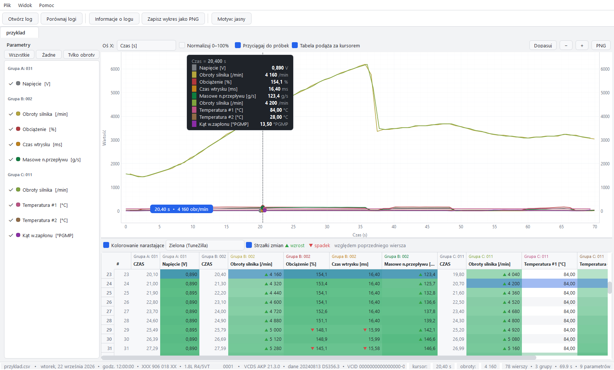

# VCDS LogScope

Czytelna wizualizacja logów z programu **VCDS / VAG-COM** — program desktopowy na Windows
(Python + PySide6 + pyqtgraph). Zamiast surowego eksportu CSV dostajesz wykres nakładany
w stylu TuneZilla, tabelę z kolorowaniem narastającym i porównywanie wielu logów.



## Co potrafi

**1. Wykres nakładany (jak TuneZilla)**
- wszystkie parametry na jednym wykresie, każdy w swoim kolorze (kolor przypisywany automatycznie
  wg rodzaju parametru: obciążenie czerwone, obroty żółte, przepływ zielony, temperatura różowa…),
- **linia pomocnicza (kursor)** — pionowa linia z kropkami na każdej serii, dymkiem z wartościami
  wszystkich parametrów oraz **niebieską etykietą przy osi X** pokazującą dokładny czas **i** obroty
  w miejscu kursora (w TuneZilli trzeba się tego domyślać),
- klik = przypięcie kursora (📌), `Esc` = odpięcie, `←`/`→` = przesuwanie o jedną próbkę,
- **oś X: Czas [s] albo Obroty [obr/min]** — przełącznik w pasku nad wykresem,
- **normalizacja 0–100%** — gdy zakresy parametrów bardzo się różnią (obroty 0–6200, temperatura 80–90),
  program sam podpowiada jej włączenie, żeby było widać kształt każdej serii,
- zoom: rolka = oś X, `Ctrl`+rolka = oś Y, przeciąganie = przesuwanie, dwuklik = dopasowanie,
- eksport wykresu do PNG.

**2. Tabela z kolorowaniem narastającym**
- kolumny pogrupowane w bloki „Grupa A / B / C” (dwupoziomowy nagłówek, kolor zgodny z wykresem),
- **heatmapa** — im wyższa wartość, tym mocniejszy kolor (skale: zielona jak w TuneZilla, niebieska,
  pomarańczowa, fioletowa, tęczowa),
- **strzałki zmian ▲▼** pokazujące wzrosty i spadki względem poprzedniego wiersza (próg 1% zakresu),
- wiersz odpowiadający pozycji kursora jest podświetlony i tabela sama za nim podąża,
- klik w wiersz ustawia kursor wykresu na tym momencie,
- menu kontekstowe nagłówka = ukrywanie/pokazywanie kolumn.

**3. Porównanie dwóch lub więcej logów** (`Ctrl+T`)
- nakładka: log A linią ciągłą, log B przerywaną, C kropkowaną, D kreska-kropka,
- te same parametry = ten sam kolor, różny styl linii; w dymku widać, z którego logu jest wartość,
- **tabela różnic** Δ = log B − log A na wspólnej siatce czasu (interpolacja), z kolorowaniem delt
  (zielone = wyżej w logu B, czerwone = niżej) i opcjonalną kolumną surowych wartości logu B,
- **statystyki**: min / max / średnia dla każdego logu oraz średnia i maksymalna różnica,
- **przesunięcie czasowe logu B** — gdy logi startowały w różnych momentach jazdy.

**4. Program na Windows** — przenośna wersja `.exe` (bez instalacji), skrót na pulpicie.

## Uruchamianie

**Wersja przenośna (zalecana):**
```
dist\VCDS LogScope\VCDS LogScope.exe
```
albo skrót **VCDS LogScope** na pulpicie (`C:\Users\<użytkownik>\Desktop\VCDS LogScope.lnk`).
Nic nie jest instalowane w systemie — wystarczy skopiować cały katalog `dist\VCDS LogScope`
(ok. 152 MB) np. na pendrive'a.

Pliki logów otwierasz przez `Ctrl+O`, albo po prostu **przeciągasz CSV na okno programu**
(przeciągnięcie kilku plików zaproponuje widok porównania).

**Tryb deweloperski:**
```
run.bat                      # uruchomienie z .venv
.venv\Scripts\python.exe -m vcds_viewer plik.csv
```

## Skróty klawiszowe

| Skrót | Działanie |
|---|---|
| `Ctrl+O` / `Ctrl+Shift+O` | otwórz log / kilka logów |
| `Ctrl+T` | porównaj logi |
| `Ctrl+W` | zamknij kartę |
| `Ctrl+I` | informacje o logu (data, sterownik, grupy, parametry) |
| `Ctrl+S` | zapisz wykres jako PNG |
| `Ctrl+D` | motyw ciemny / jasny |
| `←` `→` | kursor o jedną próbkę |
| klik / `Esc` | przypnij / odepnij kursor |
| rolka / `Ctrl`+rolka | zoom osi X / osi Y |
| dwuklik | dopasuj widok |

## Obsługiwany format logów

Eksport CSV z VCDS w wersji polskiej i angielskiej (kodowanie CP1250/CP1252/UTF-8):

```
Wtorek,22,Wrzesień,2026,18:59:06:00009-VCID:…,Wersja VCDS: AKP 21.3.0,Wersja danych: …
4B0 906 018 AA,,1.8L R4/5VT         0001,
,Grupa A:,'031,,,,Grupa B:,'002,,,,Grupa C:,'011
,,Napięcie,Bity binarnie,…,Obroty silnika,Obciążenie,Czas wtrysku,Masowe n.przepływu,…
,CZAS,,,,,CZAS,,,,,CZAS,,,,
Znacznik,ZAPISU, V,,,,ZAPISU, /min, %, ms, g/s,ZAPISU, /min,*C,*C, *PGMP
,0.30,0.005,…,0.60,1560,13.5,0.00,4.06,0.00,1560,84.0,30.0,-2.3
```

Parser radzi sobie z: polskim i angielskim nagłówkiem (`Grupa/Group`, `CZAS/TIME`, `Znacznik/Marker`),
dowolną liczbą grup (1–3), osobnymi kolumnami czasu każdej grupy, kolumnami binarnymi
(„Bity binarnie” — trafiają do tabeli, nie na wykres), przecinkiem dziesiętnym, wieloma blokami
logowania w jednym pliku oraz pustymi kolumnami.

## Budowa wersji .exe

```
uv venv --python 3.11 .venv
uv pip install --python .venv\Scripts\python.exe PySide6 pyqtgraph numpy pytest pillow pyinstaller
.venv\Scripts\python.exe tools\build_exe.py
```
Skrypt: rysuje ikonę (Qt → PNG → `.ico` przez Pillow), buduje paczkę PyInstaller
(`--onedir`, wykluczone nieużywane moduły Qt), **uruchamia autotest gotowego .exe**
i tworzy skrót na pulpicie. Wynik: `dist\VCDS LogScope\VCDS LogScope.exe` (~152 MB).

Autotest (działa też bez GUI, przydatny po każdej zmianie):
```
"dist\VCDS LogScope\VCDS LogScope.exe" --selftest LOG-01-031-002-011-V10.CSV build\selftest_exe
```
Wczytuje log, buduje wykres i widok porównania, zapisuje zrzuty i `selftest_report.txt`.

**Uwaga przy pakowaniu:** nie wykluczaj `PySide6.QtOpenGL` — pyqtgraph importuje go
bezwarunkowo i aplikacja nie wystartuje (`ModuleNotFoundError`).

## Testy

```
.venv\Scripts\python.exe -m pytest tests\ -q     # 15 testów
```
Testy pokrywają parser (nagłówek PL/EN/DE, grupy, jednostki, kolumny binarne, oś RPM,
dopasowanie parametrów między logami, pliki bez danych) oraz przypisywanie kolorów.

## Struktura projektu

```
vcds_viewer/
  parser.py      # czytanie CSV z VCDS (kodowania, grupy, jednostki, bloki)
  model.py       # model danych: LogData / Group / Channel, oś X czas|RPM
  colors.py      # paleta w stylu TuneZilla + unikalne kolory serii
  chartview.py   # wykres nakładany, kursor, dymek, etykieta przy osi X
  tableview.py   # tabela: heatmapa, strzałki zmian, nagłówek grupowy
  compare.py     # porównanie logów: nakładka + tabela różnic + statystyki
  logview.py     # widok jednego logu (wykres + panel parametrów + tabela)
  mainwindow.py  # okno główne, karty, menu, drag & drop, ostatnie pliki
  theme.py       # motyw ciemny/jasny
  formatting.py  # polskie formatowanie liczb (1 234,56)
tests/           # testy parsera i modelu
tools/           # zrzuty ekranu do weryfikacji, budowa .exe
```
